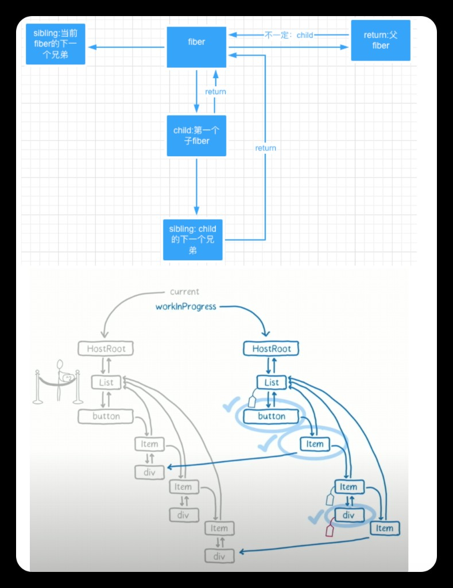

# 什么是Fiber架构？

## Fiber的背景

Fiber 并不是 React 独有，而是一个常见的计算机术语，常翻译为**纤程**。在 Ruby、PHP 中都有应用。

在PHP中的描述：可中断、可暂停，这些描述是不是和 React Fiber 很像？

> 参考：[维基百科 Fiber (computer science)](https://en.wikipedia.org/wiki/Fiber_(computer_science))

---

## 什么是Fiber

Fiber 是 React16 中的协调引擎。它的主要目的是使 VDOM 可以进行增量式渲染。

React Fiber 的目标是提高其在动画、布局和手势等领域的适用性。

### 核心特性

1. **实现增量式渲染（incremental rendering）**：即将渲染工作拆分为多个块，并分散在多个帧上进行处理
2. **支持暂停、中止或复用工作单元（work）**
3. **给不同类型的 work 赋予优先级**
4. **为并发提供基础**
5. **更好地支持错误边界**

---

## 协调（Reconciliation）

**协调**是指 React DIFF 新老 VDOM 的算法，React 根据这个算法来确定哪些 VDOM 和 DOM 需要更改。

由于 re-render 整个应用在性能方面是极其昂贵的，因此 React 具有优化功能，可以在保持良好性能的同时创建整个应用程序重新渲染的外观。这些优化的大部分是 reconciliation 过程的一部分。

协调是"VDOM"背后的算法。当你渲染一个 React 应用程序时，会生成并保存一个描述应用程序的节点树在内存中。然后将这棵树刷新到渲染环境中 — 例如，在浏览器应用程序的情况下，它会被转换为一组 DOM 操作。当应用程序被更新（通常通过 setState），会生成一个新的树。新树会与之前的树进行差异比较，以计算需要更新渲染应用程序的操作。

---

## 核心概念

### update

引发 React app 的 render，通常是通过 setState 来实现的，最终会导致重新渲染（re-render）。

React 的 API 的核心就是引发 re-render 的 update。

### work

工作单元。

一个 fiber 是指一个将要执行或者已经执行完了的工作单元（unit of work）。一个组件可以有一个或者多个 fiber。

### work in progress

正在执行的工作单元。

React 源码中对于正在执行的 fiber，命名为 workInProgress。

### current

React 源码中使用 current 命名旧 fiber，即已经执行完成了的 work。

---

## Fiber数据结构

源码位置：`react/packages/react-reconciler/src/ReactInternalTypes.js`

```typescript
export type Fiber = {
  // 标记fiber的类型，即描述的组件类型，如原生标签、函数组件、类组件、Fragment等
  tag: WorkTag,
  
  // 标记组件在当前层级下的的唯一性
  // 学号
  // 协调阶段使用key区分组件
  // 复用组件满足三大要素：同一层级下、相同类型、相同的key值
  key: null | string,
  
  // 组件类型
  elementType: any,
  
  // 标记组件类型，如果是原生组件，这里是字符串，如果是函数组件，这里是函数
  type: any,
  
  // 如果组件是原生标签，是DOM；如果是类组件，是实例；如果是函数组件，是null
  stateNode: any,
  
  // 父fiber
  return: Fiber | null,
  
  // 单链表结构
  // 第一个子fiber
  child: Fiber | null,
  
  // 下一个兄弟fiber
  sibling: Fiber | null,
  
  // 记录了节点在当前层级中的位置下标，用于diff时候判断节点是否需要发生移动
  index: number,
  
  // The ref last used to attach this node.
  ref:
    | null
    | (((handle: mixed) => void) & {_stringRef: ?string, ...})
    | RefObject,
  refCleanup: null | (() => void),
  
  // 新的props
  pendingProps: any,
  
  // 上一次渲染时使用的 props
  memoizedProps: any,
  
  // 队列，存储updates与callbacks，比如createRoot(root).render或者setState的回调
  updateQueue: mixed,
  
  // 不同的组件的 memoizedState 存储不同
  // 函数组件 hook0（Hooks链表）
  // 类组件 state
  memoizedState: any,
  
  // 依赖，比如context
  dependencies: Dependencies | null,
  
  // 模式
  mode: TypeOfMode,
  
  // Effect
  flags: Flags,
  subtreeFlags: Flags,
  
  // 记录要删除的子节点
  deletions: Array<Fiber> | null,
  
  lanes: Lanes,
  childLanes: Lanes,
  
  // 用于存储更新前的fiber
  alternate: Fiber | null,
};
```

### Fiber指针结构与双缓冲机制



**图解说明：**

**上半部分 - Fiber指针关系：**
- `return`：指向父Fiber
- `child`：指向第一个子Fiber
- `sibling`：指向下一个兄弟Fiber

通过这三个指针，Fiber节点形成了一个单链表结构，可以实现可中断的遍历。

**下半部分 - 双缓冲机制：**
- `current`：当前屏幕上显示的Fiber树
- `workInProgress`：正在内存中构建的Fiber树
- 两棵树通过 `alternate` 字段相互指向
- 更新完成后，`workInProgress` 变成新的 `current`

这种双缓冲机制可以在不影响当前UI的情况下，在内存中构建新的Fiber树，提交时只需切换指针即可。

---

## WorkTag类型

源码位置：`react/packages/react-reconciler/src/ReactWorkTags.js`

```typescript
export type WorkTag =
  | 0  | 1  | 2  | 3  | 4  | 5  | 6  | 7
  | 8  | 9  | 10 | 11 | 12 | 13 | 14 | 15
  | 16 | 17 | 18 | 19 | 20 | 21 | 22 | 23
  | 24 | 25 | 26 | 27;

export const FunctionComponent = 0;
export const ClassComponent = 1;
export const IndeterminateComponent = 2; // Before we know whether it is function or class
export const HostRoot = 3; // Root of a host tree. Could be nested inside another node.
export const HostPortal = 4; // A subtree. Could be an entry point to a different renderer.
export const HostComponent = 5;
export const HostText = 6;
export const Fragment = 7;
export const Mode = 8;
export const ContextConsumer = 9;
export const ContextProvider = 10;
export const ForwardRef = 11;
export const Profiler = 12;
export const SuspenseComponent = 13;
export const MemoComponent = 14;
export const SimpleMemoComponent = 15;
export const LazyComponent = 16;
export const IncompleteClassComponent = 17;
export const DehydratedFragment = 18;
export const SuspenseListComponent = 19;
export const ScopeComponent = 21;
export const OffscreenComponent = 22;
export const LegacyHiddenComponent = 23;
export const CacheComponent = 24;
export const TracingMarkerComponent = 25;
export const HostHoistable = 26;
export const HostSingleton = 27;
```
